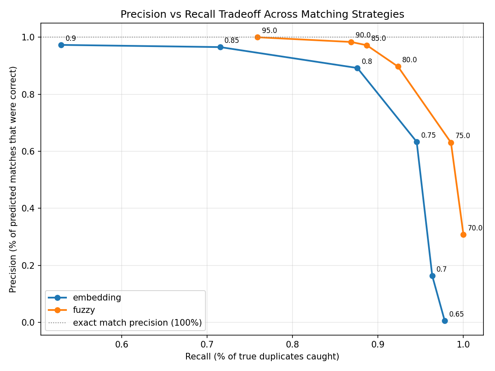

# Entity Matching Benchmark

**By Kirti Gupta**

## TL;DR

Fuzzy matching outperformed embedding-based matching on this benchmark —
higher F1 and ~22x faster.

| Method | F1 | Runtime |
|---|---|---|
| Exact match | 0.104 | 0.006s |
| **Fuzzy match** | **0.928** | **0.19s** |
| Embedding match | 0.884 | 4.21s |

**Key result:** the more "sophisticated" AI-based approach did not win.
Fuzzy matching achieved the highest F1 score, held up across 10
independent random datasets (not a lucky run), and passed 6 of 7
adversarial edge-case tests. Full methodology, threshold sweep, robustness
testing, and honest limitations below.



---

How do you actually know one duplicate-detection method is better than
another — not just "it feels more accurate," but with a real, measurable
number? This project builds three different strategies for detecting
duplicate people across messy records, and scores each one against a
ground-truth dataset to find out which genuinely performs best, and why.

This directly extends an earlier project (an entity-resolution pipeline
merging real messy applicant data with no shared ID across sources) — that
project made real judgment calls about matching duplicates, but had no way
to *prove* how accurate those calls were. This project fixes that by
building a proper evaluation harness.

## The problem

Duplicate/near-duplicate records are a real, costly, ongoing problem —
mismatched patient records in healthcare, failed KYC checks in banking
when "Robert Smith" and "Rob Smith" look like different people, wasted
marketing spend mailing the same customer multiple catalogs under name
variants. Most systems handle this with a naive exact-match join, which
(as shown below) catches only a small fraction of real duplicates.

## Approach

1. **Generate a synthetic dataset with known ground truth** — 200 real
   "people," each with 1-3 noisy variants (typos, nickname swaps, phone
   format changes, casing differences), so the true answer is always known
   and precision/recall can be calculated exactly, not estimated.
2. **Build three matching strategies:**
   - **Exact match** — baseline; requires identical name + phone strings
   - **Fuzzy string matching** — edit-distance similarity (rapidfuzz),
     linked via union-find clustering
   - **Embedding-based matching** — pretrained sentence embeddings
     (`all-MiniLM-L6-v2`), comparing semantic similarity via cosine
     distance, also clustered via union-find
3. **Score every strategy** using pairwise precision, recall, and F1
   against the hidden ground truth — the standard evaluation approach used
   in real record-linkage research.
4. **Sweep thresholds** for both fuzzy and embedding matching, rather than
   reporting a single lucky number, to show the full tradeoff curve.

## Results

| Strategy | Best threshold | Precision | Recall | F1 | Runtime |
|---|---|---|---|---|---|
| Exact match (baseline) | — | 100.00% | 5.47% | 0.104 | 0.006s |
| **Fuzzy match** | **85** | **97.20%** | **88.69%** | **0.9275** | 0.19s |
| Embedding match | 80 | 89.22% | 87.59% | 0.8840 | 4.21s |

## Robustness check: does this hold across different random datasets?

A single result could be a coincidence of that one particular random
dataset. To check, the comparison was re-run on **10 independently
generated synthetic datasets** (different random seeds) at each
strategy's best threshold:

| Strategy | Precision (mean ± std) | Recall (mean ± std) | F1 (mean ± std) |
|---|---|---|---|
| **Fuzzy (threshold=85)** | 99.27% ± 1.27% | 92.24% ± 2.10% | **95.60% ± 1.04%** |
| Embedding (threshold=0.80) | 91.39% ± 3.85% | 90.64% ± 2.69% | 90.98% ± 2.67% |

Fuzzy matching beat embedding matching's F1 score in **10 out of 10**
independent runs — not a coincidence of one lucky dataset. Fuzzy matching's
standard deviation is also roughly 2.5x tighter than embedding's,
meaning it isn't just better on average, it's more consistent and
predictable — a property that matters as much as raw accuracy in a
production system.

## Key finding: fuzzy matching wins, and it's not close

The precision-recall curve shows fuzzy matching's line sitting above and
to the right of embedding matching's line across nearly the entire
threshold range — meaning fuzzy matching dominates: at almost any recall
level, it achieves that recall with higher precision than embeddings do.
This held up across a full threshold sweep, not just one cherry-picked
setting.

Key result: the embedding-based approach did not outperform fuzzy
matching on this benchmark. For this dataset — where most duplicates came
from typos and formatting inconsistencies rather than nickname-style
semantic differences — character-level comparison was the better tool for
the job, and dramatically faster (22x).

### Why embeddings struggled here

Cosine similarity between two *unrelated* names rarely lands near zero,
because embedding models learn a general "these are all names" cluster in
vector space — unlike raw string comparison, where two unrelated strings
naturally score close to zero similarity. This means embeddings have a
much narrower safe operating range: dropping the threshold from 0.70 to
0.65 caused false positives to explode from 1,352 to 47,311, because that
small change crossed below the "background noise" level where most
unrelated name pairs already cluster. Fuzzy matching degraded far more
gradually at low thresholds for the same reason in reverse — unrelated
strings start from a much lower similarity baseline.

### Where embeddings would likely win instead

This result is specific to this dataset's noise profile. Embeddings'
real strength — catching nicknames and semantically related but
differently-spelled names ("Vicky" vs "Vikram") — would matter more in a
dataset where that kind of variation is the dominant source of duplicates,
rather than typos and formatting inconsistencies. A fair follow-up test
would be a dataset intentionally weighted toward nickname-style variation
to see the crossover point.

## Adversarial edge-case testing

Beyond aggregate statistics, seven hand-crafted test cases with known
correct answers were run against exact and fuzzy matching individually —
covering identical records, same-name-different-phone (the dangerous
false-merge scenario), phone formatting differences, typos, missing
fields, unrelated people, and shortened names.

| Case | Expected | Exact | Fuzzy |
|---|---|---|---|
| Identical strings | Match | ✓ | ✓ |
| Same name, different phone | No match | ✓ | ✓ |
| Phone formatting difference | Match | ✗ | ✓ |
| Single-character typo | Match | ✗ | ✓ |
| Missing/empty last name | Match | ✗ | ✗ |
| Completely unrelated people | No match | ✓ | ✓ |
| Short name / initials | Match | ✗ | ✓ |

Fuzzy matching passed 6 of 7 cases, correctly handling formatting
differences, typos, and — critically — correctly *refusing* to merge two
different people who share a common name, which is the more dangerous
failure mode in a real system.

**Known limitation, found directly by this test:** both strategies fail
on missing/truncated fields (e.g. "Tanvi Gupta" vs. just "Tanvi") — the
name similarity score is too low even under fuzzy matching, since a large
portion of the string is genuinely absent rather than misspelled. This is
a real, specific weakness worth stating plainly rather than a gap
discovered later in production: a system relying purely on name/phone
similarity would need a dedicated handling rule for partial/truncated
names (e.g. prefix matching or treating missing fields as wildcards)
rather than relying on general string similarity alone.

## Project structure

```
├── generate_data.py       # builds the synthetic ground-truth dataset
├── people_raw.csv          # generated dataset (200 people, ~400 records)
├── evaluate.py              # scoring engine (precision/recall/F1), reused by all strategies
├── strategy_exact.py         # Strategy 1: exact match baseline
├── strategy_fuzzy.py          # Strategy 2: fuzzy string matching
├── strategy_embedding.py       # Strategy 3: embedding-based matching
├── sweep_thresholds.py          # runs all thresholds, produces chart + CSV
├── sweep_results.csv             # full results across every threshold tested
├── tradeoff_curve.png             # precision-recall tradeoff visualization
├── multi_seed_eval.py              # robustness check across 10 random datasets
├── multiseed_fuzzy_results.csv      # per-run results, fuzzy strategy
├── multiseed_embedding_results.csv   # per-run results, embedding strategy
└── edge_cases.py                      # adversarial hand-crafted test suite
```

## How to run it

```bash
pip install pandas rapidfuzz sentence-transformers matplotlib

python generate_data.py        # builds the dataset
python strategy_exact.py        # baseline
python strategy_fuzzy.py         # fuzzy matching, single threshold
python strategy_embedding.py      # embedding matching, single threshold
python sweep_thresholds.py         # full comparison across thresholds + chart
python multi_seed_eval.py           # robustness check across 10 random datasets
python edge_cases.py                 # adversarial hand-crafted test suite
```

## Notable design decisions

- **Ground truth via synthetic data, not real scraped data** — avoids any
  privacy concern, and critically, makes exact precision/recall
  measurement possible, which isn't achievable on real-world data without
  a manually-labeled answer key.
- **Pairwise precision/recall** rather than per-record accuracy — the
  standard evaluation method in record-linkage research, since it handles
  clusters of arbitrary size cleanly.
- **Union-find clustering** for both fuzzy and embedding strategies —
  reused from the earlier entity-resolution project, applied here to a
  controlled, measurable benchmark instead of real messy data.
- **O(n²) comparison approach** — every record is compared to every other
  record. This is fine at ~400 records but would need blocking (e.g. only
  comparing records within the same city) to scale to real production
  volumes of millions of records — a known, stated limitation rather than
  a gap discovered later.

## Stack

Python · pandas · rapidfuzz · sentence-transformers (`all-MiniLM-L6-v2`) ·
matplotlib

## What I'd improve next

The current benchmark uses exhaustive pairwise comparison (O(n²)), so the
natural next step is candidate generation / blocking — e.g. only comparing
records within the same city — to make this scale to real production
volumes of millions of records rather than hundreds. I'd also expand the
benchmark with different noise profiles, especially nickname-heavy data,
since the current results favor fuzzy matching specifically because of
this synthetic dataset's noise characteristics (mostly typos and
formatting issues) — a dataset weighted toward nickname-style variation
would be a fairer test of embeddings' actual strength.

